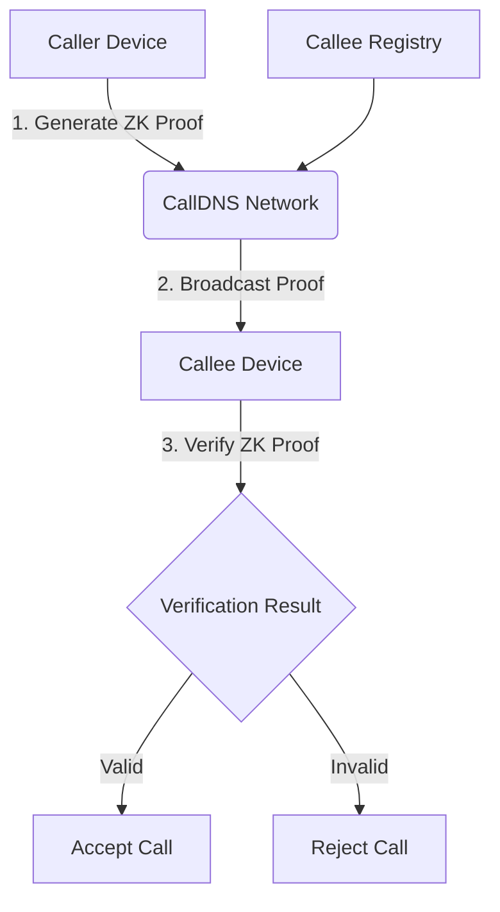

# CallDNS Architecture

## Overview
This document outlines the architecture for CallDNS, a zero-knowledge caller verification system that works above existing VoIP/communication layers to verify callers while maintaining privacy.

## System Components

### 1. Core Architecture



### 2. Key Components

#### 2.1 Device SDK
- **caller.py**: Handles ZK proof generation on caller device
- **verifier.py**: Handles proof verification on callee device
- **identity_manager.py**: Manages cryptographic identities locally

#### 2.2 Zero-Knowledge Module
- **zk_prover.py**: Implements fast ZK proof generation
- **zk_verifier.py**: Implements efficient proof verification
- **crypto_utils.py**: Cryptographic primitives and utilities

#### 2.3 Network Layer
- **broadcast.py**: Handles proof broadcasting mechanism
- **registry.py**: Manages caller-callee registry (privacy-preserving)
- **network_protocol.py**: Defines communication protocols

#### 2.4 Privacy Layer
- **privacy_preserver.py**: Ensures caller/callee anonymity
- **anonymous_registry.py**: Privacy-preserving registration
- **obfuscator.py**: Additional privacy measures

## Detailed Design

### 3. Zero-Knowledge Implementation

We'll use a Schnorr-based signature scheme for fast ZK proofs:

1. **Key Generation**:
   - Each caller generates a private key `x` and public key `Y = g^x`
   - Keys are stored only on the device

2. **Proof Generation** (Caller side):
   ```
   # For each call:
   1. Generate random nonce: r ← Z_q
   2. Compute commitment: R = g^r
   3. Compute challenge: c = H(R || Y || metadata)
   4. Compute response: s = r + c*x mod q
   5. Proof π = (R, s)
   ```

3. **Verification** (Callee side):
   ```
   1. Receive proof π = (R, s)
   2. Compute challenge: c = H(R || Y || metadata)
   3. Verify: R = g^s * Y^(-c)
   ```

### 4. Privacy Implementation

To ensure CallDNS cannot identify originator or receiver:

1. **No Centralized Identity Mapping**:
   - Caller identities are self-sovereign
   - No central registry of who-is-who

2. **Ephemeral Keys**:
   - Use temporary session keys for each call
   - Rotate keys periodically

3. **Metadata Minimization**:
   - Only include necessary data in proofs
   - Strip identifying information

4. **Broadcast Mechanism**:
   - Proofs are broadcast anonymously
   - Callees filter for relevant proofs

### 5. Fast ZK Algorithm Selection

For optimal performance, we'll implement:

1. **Schnorr Signatures**:
   - Fast verification: ~1-2ms
   - Small proof size: ~64 bytes
   - Well-established security

2. **Curve Selection**:
   - Use Curve25519 for ECDLP security
   - Optimized implementations available

3. **Batch Verification**:
   - Allow verification of multiple proofs simultaneously
   - Further performance improvements

## Implementation Plan

### 6. Python Package Structure

```
calldns/
├── __init__.py
├── sdk/
│   ├── __init__.py
│   ├── caller.py
│   ├── verifier.py
│   └── identity_manager.py
├── crypto/
│   ├── __init__.py
│   ├── zk_prover.py
│   ├── zk_verifier.py
│   └── crypto_utils.py
├── network/
│   ├── __init__.py
│   ├── broadcast.py
│   ├── registry.py
│   └── protocol.py
├── privacy/
│   ├── __init__.py
│   ├── privacy_preserver.py
│   └── anonymous_registry.py
├── tests/
│   ├── __init__.py
│   ├── test_zk.py
│   ├── test_privacy.py
│   └── test_network.py
└── examples/
    ├── __init__.py
    ├── basic_call.py
    └── verification_demo.py
```

### 7. Core Implementation Details

#### 7.1 Caller SDK (sdk/caller.py)
```python
class Caller:
    def __init__(self):
        self.identity_manager = IdentityManager()
        self.zk_prover = ZKProver()
    
    def generate_call_proof(self, metadata=None):
        """Generate ZK proof for outgoing call"""
        return self.zk_prover.generate_proof(
            self.identity_manager.get_private_key(),
            metadata
        )
    
    def broadcast_proof(self, proof):
        """Broadcast proof via network layer"""
        # Implementation in network.broadcast
        pass
```

#### 7.2 Verifier SDK (sdk/verifier.py)
```python
class Verifier:
    def __init__(self):
        self.zk_verifier = ZKVerifier()
    
    def verify_call_proof(self, proof, caller_public_key):
        """Verify incoming call proof"""
        return self.zk_verifier.verify_proof(
            proof, 
            caller_public_key
        )
```

#### 7.3 ZK Prover (crypto/zk_prover.py)
```python
class ZKProver:
    def generate_proof(self, private_key, metadata=None):
        """Fast Schnorr-based ZK proof generation"""
        # Implementation details
        pass
```

#### 7.4 Privacy Preserver (privacy/privacy_preserver.py)
```python
class PrivacyPreserver:
    @staticmethod
    def anonymize_metadata(metadata):
        """Remove identifying information from metadata"""
        # Implementation details
        pass
    
    @staticmethod
    def generate_ephemeral_keys():
        """Generate temporary session keys"""
        # Implementation details
        pass
```

## Security Considerations

### 8. Privacy Guarantees
1. **Caller Anonymity**: CallDNS cannot identify who is calling
2. **Receiver Privacy**: CallDNS cannot identify who is being called
3. **Call Linkability**: Prevent linking multiple calls from same caller
4. **Metadata Protection**: Minimize information leakage

### 9. Cryptographic Security
1. **Forward Secrecy**: Ephemeral keys protect past communications
2. **Resistance to Quantum Attacks**: Consider post-quantum options
3. **Side-Channel Resistance**: Protect against timing attacks

## Performance Optimization

### 10. Fast ZK Algorithms
1. **Pre-computation**: Calculate common values ahead of time
2. **Batching**: Process multiple proofs together when possible
3. **Hardware Acceleration**: Use specialized libraries (e.g., libsecp256k1)

### 11. Network Optimization
1. **Efficient Broadcasting**: Use multicast/UDP for proof distribution
2. **Compression**: Minimize proof size
3. **Caching**: Cache recent verification results

## Next Steps

1. Implement core cryptographic primitives
2. Build ZK prover/verifier modules
3. Develop privacy protection mechanisms
4. Create network broadcast system
5. Build device SDK interfaces
6. Comprehensive testing and security audit